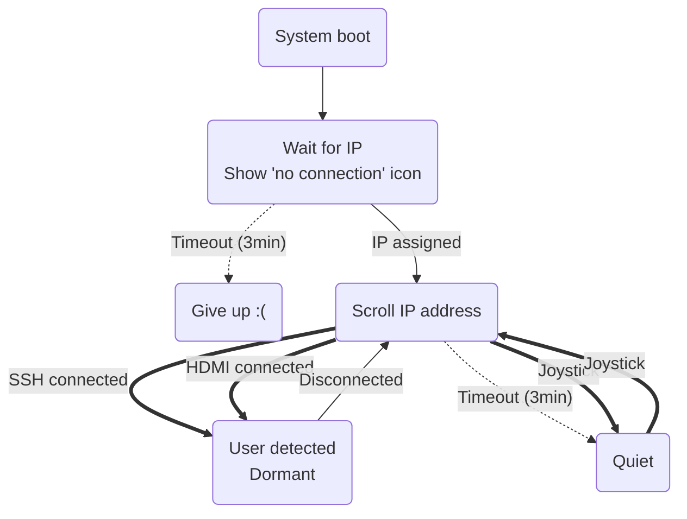

# sensehat-startup-ip
A script to automatically print out a Raspberry Pi's IP address on a connected SenseHAT when the device boots up.

## Behavior

In the "dormant" state, nothing will be shown until all indicators of user presence are gone.

In the "quiet" state, a joystick middle-click event will reset the 3-minute timeout on the IP address scrolling across the screen. Any other joystick event will just show the IP once.

## Installation
As root:
1. Move `boot_sense_ip.py` into your Pi's `/etc/` directory (do *not* set the executable bit on it)
1. Edit `/etc/rc.local` to include this line: `/usr/bin/env python3 /etc/boot_sense_ip.py &`

## Testing + Debugging
If you need to kill the process that started at boot, use `ps aux | grep python` to find the offending process, usually running as `root`.

You can also run this script manually like any normal python script. There are a handful of command line flags useful for testing and debugging without forcing a reboot, run with `-h` to get a usage message.

Optional improvements to your `rc.local` file:
1. Have it log output to a file: `exec 1>/tmp/rc.local.log.$$ 2>&1` (print with `tail /tmp/rc.local.log.*`)
1. Print the background job's ID after it's spawned: `jobs -p`
